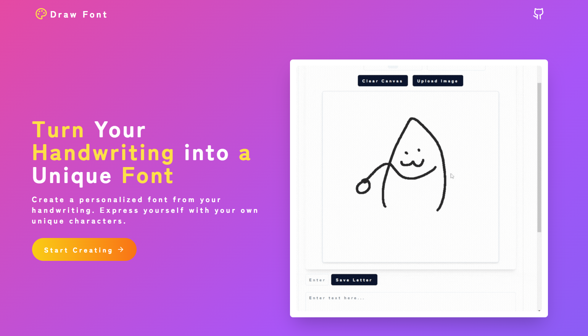
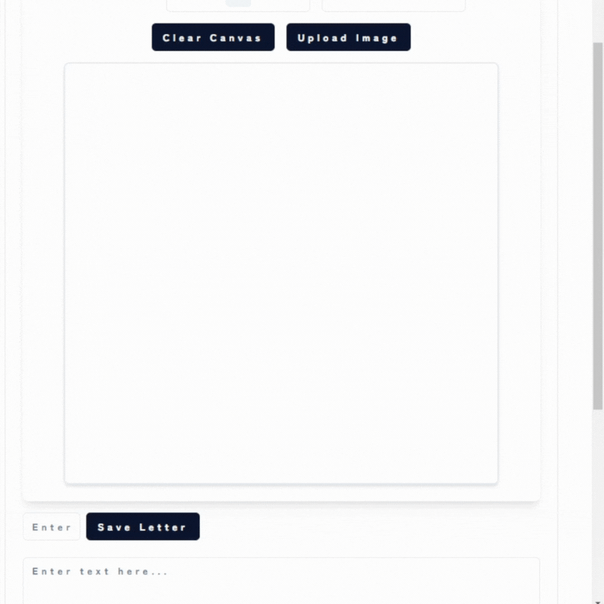
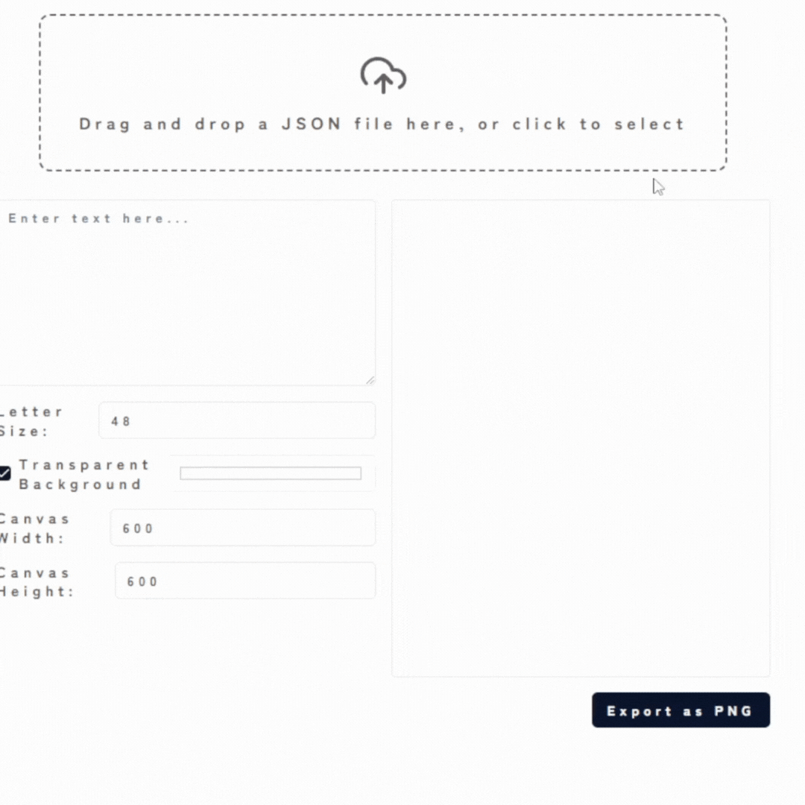
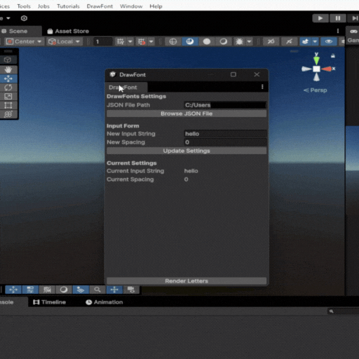
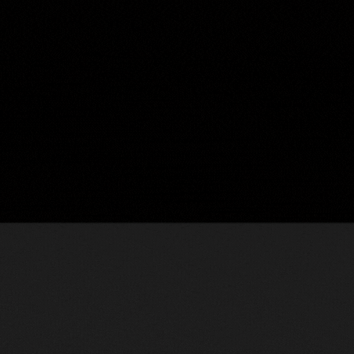

# drawfont

Website: https://drawfont.com

## Overview

English:

DrawFont is an open-source software (OSS) project that allows handwritten fonts to be loaded and used in various projects.
As long as you have a DrawFont file in JSON format, you can load and use that font anywhere.
While the number of compatible software is currently limited, we plan to expand the range of supported applications in the future.
We guarantee that the license will remain MIT for the foreseeable future.
Due to a shortage of manpower, we welcome active contributions.

Chinese (Simplified):

DrawFont是一个开源软件（OSS）项目，它允许在各种项目中加载和使用手写字体。
只要您有JSON格式的DrawFont文件，就可以在任何地方加载和使用该字体。
虽然目前兼容的软件数量有限，但我们计划在未来扩大支持的应用范围。
我们保证在可预见的未来，该项目将继续使用MIT许可证。
由于人手不足，我们欢迎积极的贡献。

Japanese:
DrawFontは、手書きのフォントを様々なプロジェクトで読み込んで使用できるようにするオープンソースソフトウェア（OSS）プロジェクトです。 
JSON形式のDrawFontファイルさえあれば、どこでもそのフォントを読み込んで使用できます。
 現在対応しているソフトウェアは限られていますが、今後対応範囲を拡大していく予定です。
ライセンスは将来にわたってMITライセンスであることを保証します。
人手が不足しているため、積極的なコントリビューションをお待ちしています。

Korean:
DrawFont는 손글씨 폰트를 다양한 프로젝트에서 불러와 사용할 수 있게 하는 오픈 소스 소프트웨어(OSS) 프로젝트입니다.
JSON 형식의 DrawFont 파일만 있다면 어디서든 해당 폰트를 불러와 사용할 수 있습니다.
현재 호환되는 소프트웨어는 제한적이지만, 향후 지원 범위를 확대할 계획입니다.
라이선스는 앞으로도 계속 MIT 라이선스로 유지될 것을 보장합니다.
인력이 부족하므로 적극적인 기여를 환영합니다.

## LICENSE

MIT forever

This license only restricts starting identical SaaS projects.

## Compatible Software

- Unity Editor
- Blender
- Web (React)

## Coming Soon

- Canva
- Unreal Engine
- Godot
- After Effects
- Photoshop
- Illustrator
- 3ds Max
- Cinema 4D
- Houdini
- Substance Painter
- ZBrush
- etc...

## Roadmap

- [ ] Support story progression dialogs
- [ ] Add particle effects using ancient-style characters
- [ ] Add various types of Playgrounds
- [ ] Publish a dedicated npm package for usage
- [ ] etc...

## Demo

### Web Drawing

### Web Writing

### Unity

### Blender

